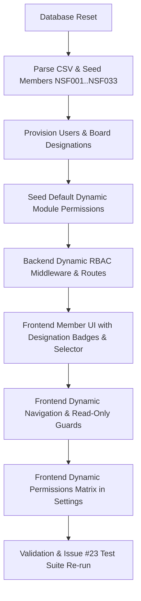

# Implementation Plan — issue #29: DB Reset, CSV Member Seeding, Board of Directors Designations & Dynamic Module RBAC

## Executive Summary
This implementation fulfills the user's requirements:
1. **DB Reset & Fresh Seeding**: Delete all existing MongoDB documents and seed all members from [`docs/Updated-NS FOUNDATION 2024 - Sorted Members.csv`](file:///c:/TechVelly/NSFoundationWebApp/docs/Updated-NS%20FOUNDATION%202024%20-%20Sorted%20Members.csv) with IDs starting from `NSF001` through `NSF033`.
2. **Board of Directors Designations**:
   - Designations: **Director**, **President**, **Accountant**, **Assistant Accountant**, **General Secretary**, **Convener**, and **General Member** (default).
   - Display member designation prominently beside their name in the member list/cards.
   - Allow Admins/Super Admins to assign and update member designations in the Member Management UI.
3. **Role-Based Access Control (RBAC) & Dynamic Permissions**:
   - **Director**: Has Admin full editorial permission across society management, but **strict read-only permission** to:
     - *Contributions & Payments*
     - *Member Management*
     - *Accountant Custody Ledger*
   - **Accountant Moin**: Has **Super Admin** authority with full editorial permission to edit anything.
   - **Dynamic Module Permission System**: Super Admin can dynamically view and update module accessibility (`canView` and `canEdit`) for every role/designation via a backend API and frontend settings interface.
4. **Issue #23 Regression Re-Verification**: Re-run the automated integration and regression test suite to ensure 100% test passage.

---

## Architecture & Implementation Steps

### Phase 1: Database Schema & Type System
1. **`backend/src/types/models.ts` & `frontend/src/types/member.ts`**:
   - Define `MemberDesignation` enum:
     - `DIRECTOR = 'DIRECTOR'`
     - `PRESIDENT = 'PRESIDENT'`
     - `ACCOUNTANT = 'ACCOUNTANT'`
     - `ASSISTANT_ACCOUNTANT = 'ASSISTANT_ACCOUNTANT'`
     - `GENERAL_SECRETARY = 'GENERAL_SECRETARY'`
     - `CONVENER = 'CONVENER'`
     - `GENERAL_MEMBER = 'GENERAL_MEMBER'`
   - Update `IMember` interface with `designation: MemberDesignation`.
   - Update `IUser` interface with `designation?: MemberDesignation` and `memberId?: Types.ObjectId`.
2. **`backend/src/models/Member.ts`**:
   - Add `designation` field with enum validation and default `GENERAL_MEMBER`.
3. **`backend/src/models/User.ts`**:
   - Add `designation` and `memberId` fields.
4. **`backend/src/models/ModulePermission.ts`**:
   - New model storing dynamic permissions per role/designation:
     - `roleOrDesignation`: string (e.g. `DIRECTOR`, `PRESIDENT`, `ACCOUNTANT`, `ASSISTANT_ACCOUNTANT`, `GENERAL_SECRETARY`, `CONVENER`, `GENERAL_MEMBER`, `SUPER_ADMIN`, `ADMIN`).
     - `modules`: Map or Array of `{ moduleKey: string, canView: boolean, canEdit: boolean }`.
     - Default configuration:
       - `SUPER_ADMIN`: All view=true, edit=true.
       - `DIRECTOR`: All view=true, edit=true EXCEPT `PAYMENTS` (edit=false), `MEMBERS` (edit=false), `CUSTODY` (edit=false).
       - `ACCOUNTANT` / `ASSISTANT_ACCOUNTANT`: Full financial modules access.

### Phase 2: Reset & Seeding Automation
1. **`backend/src/scripts/reset-and-seed.ts`**:
   - Connect to MongoDB and wipe all relevant collections.
   - Parse `docs/Updated-NS FOUNDATION 2024 - Sorted Members.csv`.
   - Clean names (strip suffix tags like `-Director`, `-President`, `-Accountant`, `-Asst. Acc`, `-GS`, `-Convener`).
   - Create 33 members with exact IDs `NSF001` through `NSF033`.
   - Create initial `ShareHistory` records corresponding to CSV shares.
   - Create users with bcrypt-hashed passwords:
     - `admin@nsfoundation.org` (Moin Uddin) -> Role: `SUPER_ADMIN`, Designation: `ACCOUNTANT`, AccountantType: `PRIMARY`.
     - `director@nsfoundation.org` (Salah Uddin Shuvo) -> Role: `ADMIN`, Designation: `DIRECTOR`.
     - `president@nsfoundation.org` (Safiqul Islam) -> Role: `ADMIN`, Designation: `PRESIDENT`.
     - `assistant@nsfoundation.org` (Nurul Amin Samrat) -> Role: `ACCOUNTANT`, Designation: `ASSISTANT_ACCOUNTANT`, AccountantType: `ASSISTANT`.
     - `gs@nsfoundation.org` (Nayem Islam) -> Role: `ADMIN`, Designation: `GENERAL_SECRETARY`.
     - `convener@nsfoundation.org` (Abdul Hannan Khan) -> Role: `ADMIN`, Designation: `CONVENER`.
     - `member@nsfoundation.org` (Bayzid Hasan - NSF007) -> Role: `MEMBER`, Designation: `GENERAL_MEMBER`.
   - Seed default custody account structure only (Moin IBBL Bank, Samrat Nagad, bKash, Cash), each at ৳0.00 with no opening financial movements. Balances may change only through an authorized transaction.
   - Seed default penalty rules and gateway cashout rates.
   - Seed default `ModulePermission` document.

### Phase 3: Backend Dynamic RBAC Middleware & APIs
1. **Dynamic Permission Enforcement Middleware** (`backend/src/middlewares/auth.ts`):
   - `requireModuleAccess(moduleKey: string, action: 'view' | 'edit')`:
     - Checks user's role and designation against `ModulePermission`.
     - If user is `SUPER_ADMIN` (Accountant Moin) -> Always allow.
     - If user is `DIRECTOR` and action is `edit` on `PAYMENTS`, `MEMBERS`, or `CUSTODY` -> Return `403 Forbidden: Director role has read-only permission for this module`.
2. **Permissions Management Routes & Controller**:
   - `GET /api/settings/permissions`: Get effective module permissions matrix.
   - `PUT /api/settings/permissions`: Super Admin dynamically updates module permissions.
3. **Member Management Updates**:
   - Update `MemberController.createMember` and `updateMember` to accept and validate `designation`.
   - Guard mutation endpoints with `requireModuleAccess('MEMBERS', 'edit')`.
4. **Contributions & Custody Routes Protection**:
   - Guard payment mutations with `requireModuleAccess('PAYMENTS', 'edit')`.
   - Guard custody transfers/mutations with `requireModuleAccess('CUSTODY', 'edit')`.

### Phase 4: Frontend UI Updates
1. **Member List & Cards (`frontend/src/pages/Members.tsx` & components)**:
   - Display designation badge next to member name (e.g. `Salah Uddin Shuvo [Director]`).
   - Add Designation selector dropdown to Add/Edit Member modals.
2. **Read-Only Mode for Director in Restricted Modules**:
   - In `Payments.tsx`, `Members.tsx`, and `Custody.tsx`: check if current user has `canEdit === false`.
   - Hide or disable "Record Payment", "Add Member", "Edit Member", "Transfer Funds" buttons when read-only, displaying an informative banner: *"Read-Only View: Editorial actions are restricted for your designation."*
3. **Dynamic Sidebar Navigation (`frontend/src/components/Layout.tsx`)**:
   - Filter nav items based on user's dynamic module `canView` permissions.
4. **Module Permissions Management View**:
   - Add a "Module & Role Access Control" tab/card in Settings where Super Admin can toggle view/edit access for each role and save dynamically.

### Phase 5: Verification & Issue #23 Test Suite
1. Run `npx tsx src/scripts/reset-and-seed.ts` to cleanly reseed DB.
2. Verify all 33 members (`NSF001` - `NSF033`) and board accounts exist with correct designations.
3. Run `npm test --prefix backend` and verify all tests pass.
4. Run `npm run build --prefix frontend` to ensure TypeScript bundle integrity.
5. Create walkthrough documentation.
