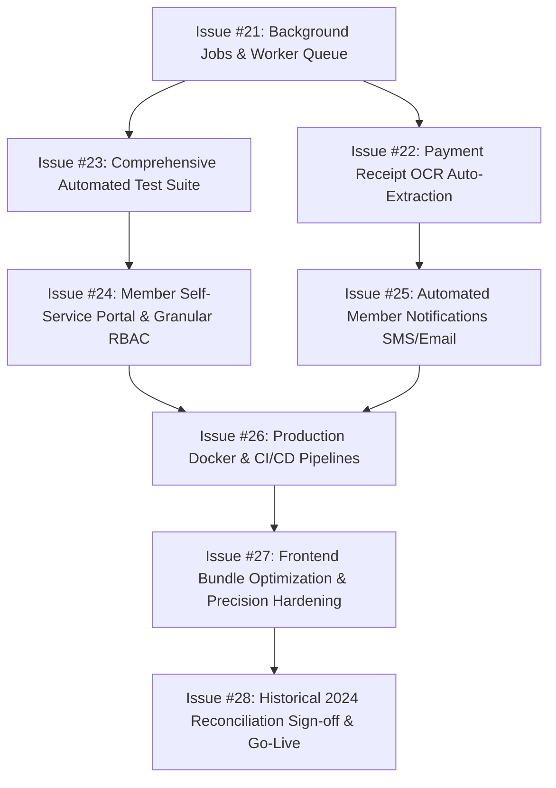

# NS Foundation Cooperative Society Web Application
# Current State Analysis & Next Development Roadmap

**Document Status:** Authoritative Analysis & GitHub Issues Roadmap  
**Target System:** Production-Grade MERN + TypeScript Web Application  
**Database:** MongoDB 8.0 (Replica Set ready)  
**Analysis Date:** 28 September 2026  

---

## 1. Executive Summary & Current Project State

A thorough analysis of the complete codebase (`frontend/`, `backend/`, `docs/`, `scripts/`) reveals that **the foundational and core operational development of the NS Foundation Cooperative Society web application is virtually complete (Issues #1 through #20 are fully implemented)**.

### What is Currently Implemented and Working:
1. **Core Domain & Security Foundations (Issues #1–3):**
   - Express + TypeScript API server and React 18 + Vite frontend with Tailwind CSS.
   - 30 MongoDB domain models covering members, shares, accounting transactions, custody, investments, governance, and audit trails.
   - JWT authentication, session version revocation, rate limiting, and server-side RBAC (Super Admin, Admin, Primary Accountant, Assistant Accountant, Member).
2. **Member & Share Management (Issues #4–5):**
   - Bangladesh (+880) and international phone normalization, membership status management.
   - Share history tracking, 2024 interim share adjustments, December 2024 final normalization, 1 January 2025 normal share lock, and post-2024 peer-to-peer share transfers.
3. **Financial Accounting Engine (Issues #6–7, #10, #15):**
   - Dynamic multi-tier contribution allocation engine resolving past dues, penalties, current monthly obligations, future advances, and gateway cash-out fee carryover.
   - Accountant custody ledger (`CustodyAccount` & `CustodyMovement`) tracking Moin (Primary) and Samrat (Assistant) custody balances as derived, immutable movements.
   - Internal custody transfers (Samrat to Moin) with zero impact on income/expense.
   - Operational expense management deducted from specific custody accounts.
   - Configurable gateway cash-out rules (bKash app 1.49%, USSD 1.70%, standard agent 1.85%; Nagad app 1.49%, USSD 1.70%; Islami Bank ATM free) with nearest-integer rounding rules.
4. **Investment & Reinvestment Portfolio (Issues #8–9):**
   - Pooled investment fund architecture separating project custody from accountant custody.
   - Funding split across accountants, expected ROI vs actual return/profit/loss recording.
   - External project wallet tracking and reinvestment chains ensuring only newly injected accountant custody is deducted.
5. **Dashboard, Reporting & Documents (Issues #11, #20):**
   - Financial KPI metrics, multi-month collections vs expenses vs outstanding dues dynamic chart.
   - Rebuildable monthly ledger matrix and CSV exports.
   - Server-side PDFKit generation of member annual statements, official payment receipts (with print preview and PNG download), annual closing reports, and full audit pack exports.
6. **Governance, Exit & Safeguards (Issues #12, #17–19):**
   - Final distribution batch calculator distributing net distributable assets according to share proportions.
   - Historical migration staging pipeline with deduplication and verification workflows.
   - Multi-document MongoDB transaction helpers and idempotency key middleware protecting financial endpoints.
   - Annual closing workflows locking closed years and carrying forward advance/due balances.
   - Member exit settlement engine (1-year eligibility, 9.99% organizational deduction, 4-month installment disbursement).
   - Official organizational Policy and PolicyVersion management.
   - Comprehensive English-to-Bangla (i18n) localization layer with instant header toggle and user preference persistence.

### Verification Health Status:
- **Backend Typecheck (`tsc --noEmit`):** PASSED (0 errors).
- **Backend Test Suite (`vitest`):** PASSED (3 baseline security tests).
- **Frontend Build (`vite build`):** PASSED (0 errors, production bundle generated).

---

## 2. Issues Implementation History (Completed Baseline)

| Issue ID | Module / Title | Status | Primary Output / Commits |
|---|---|---|---|
| **#1** | Project Foundation | **Completed** | Full repo scaffolding, Express TypeScript API, React Vite frontend. |
| **#2** | Database & Domain Models | **Completed** | 30 Mongoose schemas, indexes, and type definitions. |
| **#3** | Authentication & RBAC | **Completed** | JWT, bcrypt, session version revocation, rate limiting. |
| **#4** | Member Management | **Completed** | Member CRUD, Bangladesh & international phone normalization. |
| **#5** | Share & Annual Account | **Completed** | 2024 share history, December 2024 reconciliation, 2025 lock. |
| **#6** | Contribution & Payment | **Completed** | Payment allocation engine, printable & downloadable PNG receipts. |
| **#7** | Accountant Custody Ledger | **Completed** | Immutable movement ledger, custody accounts, Samrat-to-Moin transfers. |
| **#8** | Investment Management | **Completed** | Pooled fund tracking, multi-accountant funding, ROI vs actual return. |
| **#9** | Reinvestment & Wallets | **Completed** | Project wallet balances, reinvestment chains with newly supplied funds. |
| **#10** | Expense Management | **Completed** | Custody-deducted expenses, categories, voucher references. |
| **#11** | Dashboard & Reports | **Completed** | KPI summary, multi-month dynamic chart, monthly ledger matrix, CSVs. |
| **#12** | Final Distribution | **Completed** | Asset consolidation, batch final distribution engine. |
| **#13** | Audit & Security Scanning | **Completed** | Append-only AuditLog, read-only financial integrity scan. |
| **#14** | Deployment & Backup Design | **Documented** | Runbooks and operational procedures documented in docs folder. |
| **#15** | Gateway Rules & Cash-Out Dues | **Completed** | Centralized gateway rules, dynamic fee calculation, nearest-integer rounding. |
| **#16** | Localization (i18n) En to Bn | **Completed** | Comprehensive Bangla translations, header toggle, responsive layout. |
| **#17** | Historical Migration Staging | **Completed** | Staging collections, deduplication, review statuses, and reconciliation. |
| **#18** | Financial Atomicity & Safeguards | **Completed** | MongoDB session transactions, idempotency middleware, request sanitization. |
| **#19** | Annual Closing & Governance | **Completed** | Locked accounting years, policy versioning, member exit 9.99% settlement. |
| **#20** | Statements & Audit Pack | **Completed** | PDFKit member statements, annual reports, audit pack export downloads. |

---

## 3. What Needs to be Done Next (GitHub Issues Roadmap)

To transition this application from "development completed" to **enterprise production grade, fully tested, automated, and operationalized**, the following prioritized issues should be created in GitHub and completed sequentially.

---

### Issue #21: Background Jobs & Asynchronous Worker Architecture (BullMQ / Redis)
- **Priority:** High (P1)
- **Category:** Architecture / Performance / Scalability
- **Problem Statement:**
  Currently, heavy batch operations (generating member annual statement PDFs, rebuilding monthly ledger matrices, importing large historical migration datasets, and running custody reconciliation scans) execute synchronously on the Express HTTP request thread. As membership grows, these operations risk HTTP 504 timeouts, block the Node.js event loop, and degrade user experience.
- **Scope & Implementation Tasks:**
  1. **Worker Infrastructure:**
     - Integrate `bullmq` with `ioredis` (with graceful fallback or in-memory runner for local dev without Redis).
     - Separate the worker process from the web API process (`npm run worker`).
  2. **Job Types to Offload:**
     - `GENERATE_MEMBER_STATEMENTS_BATCH`: Bulk PDF generation for all members.
     - `REBUILD_MEMBER_LEDGER`: Asynchronous projection rebuild for one or all members.
     - `IMPORT_MIGRATION_BATCH`: Large CSV/Sheets data processing and validation.
     - `REFRESH_DASHBOARD_CACHE`: Periodic pre-aggregation of heavy KPI metrics.
  3. **Job Monitoring API & Frontend:**
     - Endpoints: `GET /api/jobs/:id`, `GET /api/jobs/recent`, `POST /api/jobs/:id/retry`.
     - Job status model in MongoDB tracking progress percentage, state (`QUEUED`, `PROCESSING`, `COMPLETED`, `FAILED`), actor, and safe error summaries.
     - Add a floating Background Job Status Toast / Drawer in the frontend so users see progress without leaving the page.
- **Acceptance Criteria:**
  - Bulk PDF exports and ledger rebuilds return HTTP 202 Accepted with a `jobId`.
  - Long-running tasks execute without blocking HTTP API responsiveness.
  - Job failures automatically retry up to 3 times with exponential backoff and record error diagnostics in the audit log.

---

### Issue #22: Optional Payment Receipt OCR & Auto-Extraction Workflow
- **Priority:** High (P1)
- **Category:** Feature / Automation / User Experience
- **Problem Statement:**
  Accountants currently have to manually re-type transaction amounts, transaction IDs (TrxID), dates, payment channels, and member IDs from mobile banking screenshots (bKash, Nagad, Islami Bank CellFin).
- **Scope & Implementation Tasks:**
  1. **Storage & Model:**
     - Implement `PaymentReceipt` model in `backend/src/models/PaymentReceipt.ts` (storing file metadata, SHA-256, extraction output, candidate matches, review status).
     - Storage adapter: Secure private local disk storage (`RECEIPT_STORAGE_DIR`) or S3-compatible bucket with signed stream retrieval (never public URLs).
  2. **OCR Adapter & Pattern Matcher:**
     - Modular provider interface (`types.ts`, `disabled-ocr-provider.ts`, `google-vision-provider.ts` or `tesseract-provider.ts`).
     - Regex parser specifically tuned for:
       - bKash App & SMS receipts (Amount, TrxID, Reference, Sender, Receiver).
       - Nagad App & SMS receipts.
       - Islami Bank / CellFin deposit receipts.
  3. **Candidate Matching & Duplicate Prevention:**
     - Deterministic matching of extracted phone/name to `Member`.
     - Matching receiver number to `CustodyAccount.accountNumber`.
     - SHA-256 hash checking and TrxID checking to prevent duplicate payment posting.
  4. **Frontend Review Workflow:**
     - Sub-tab or modal in `PaymentsPage.tsx`: Upload receipt image -> OCR extraction preview -> Accountant verifies/edits fields -> Confirm & Post via `PaymentService.recordPayment`.
- **Acceptance Criteria:**
  - OCR provides editable candidate values; it NEVER automatically posts money without accountant confirmation.
  - Duplicate receipt uploads and duplicate TrxIDs are detected and blocked.
  - Manual payment collection remains 100% functional when OCR is disabled or inconclusive.

---

### Issue #23: Comprehensive Automated Integration & Regression Test Suite
- **Priority:** High (P1)
- **Category:** Quality Assurance / Financial Integrity
- **Problem Statement:**
  The repository currently has only 3 baseline unit tests in `security-baseline.test.ts`. Because this is an auditable financial system handling real cooperative funds, regression coverage is critical before production deployment.
- **Scope & Implementation Tasks:**
  1. **API Integration Tests (Vitest + Supertest + In-Memory MongoDB):**
     - **Payment Allocation Engine:** Test exact payment, underpayment, overpayment (advance credit), late payment after 15th (penalty calculation), multi-month back dues allocation, and gateway cash-out fee carryover.
     - **Custody Movement Conservation:** Ensure fund transfers, expenses, and investments produce zero unaccounted variance across custody balances.
     - **Share Lock Verification:** Ensure normal share edits on or after 1 January 2025 are strictly blocked by validation.
     - **Annual Closing & Reconciliation:** Test year-locking, dues carryover, and final share count normalization.
     - **Member Exit Settlement:** Test 1-year eligibility requirement, 9.99% deduction math, and 4 monthly payout installment creation.
     - **Authentication & RBAC:** Test token expiration, session version revocation, rate-limiting, and unauthorized role access rejection.
  2. **Frontend Component & Smoke Tests:**
     - Route rendering smoke tests for all pages.
     - Receipt modal formatting and print preview tests.
- **Acceptance Criteria:**
  - `npm test` runs a full test suite with at least 50+ financial assertion scenarios.
  - All critical business rules specified in `BUSINESS-RULES.md` are backed by automated tests.

---

### Issue #24: Dedicated Member Self-Service Portal & Granular RBAC Permissions
- **Priority:** Medium (P2)
- **Category:** Feature / Access Control / UX
- **Problem Statement:**
  Currently, users with the role `MEMBER` can log in, but the navigation and views are primarily designed for administrative staff and accountants. A regular cooperative member needs a clean, restricted, self-service dashboard.
- **Scope & Implementation Tasks:**
  1. **Member Portal Experience:**
     - When `user.role === 'MEMBER'`, route to a dedicated Member Dashboard:
       - My Total Shares & Society Position.
       - My Current Payment Status (Up to date, Due, or Advance balance).
       - Detailed breakdown of my monthly dues, late penalties, and gateway charges.
       - My Contribution History table with one-click download for each payment receipt (PDF/PNG).
       - One-click download of my official Annual Member Statement (PDF).
       - My Profile info & password change.
  2. **Strict Navigation & API Guarding:**
     - Ensure members cannot see or call internal Accountant Custody ledgers, Organization Settings, Governance modules, or other members' confidential financial records.
  3. **Dedicated Investment Manager Role:**
     - Add `INVESTMENT_MANAGER` role allowing dedicated staff to manage investment projects and project wallets without granting access to member contribution collection or bank settings.
- **Acceptance Criteria:**
  - Logging in with a `MEMBER` account displays only their personal financial status.
  - Any direct API attempt by a member to access other members' data or custody accounts returns HTTP 403 Forbidden.

---

### Issue #25: Automated Member Notifications (SMS / WhatsApp / Email)
- **Priority:** Medium (P2)
- **Category:** Feature / Member Engagement
- **Problem Statement:**
  Members currently have no automated confirmation when an accountant records their cash or mobile payment, nor do they receive automated reminders before late penalties are applied on the 16th of each month.
- **Scope & Implementation Tasks:**
  1. **Notification Provider Service:**
     - Notification service abstraction (`NotificationService`) supporting Bangladesh SMS gateways (e.g., Greenweb, SSL Wireless, Onnorokom SMS), WhatsApp Business API, and Email (SMTP / Resend).
  2. **Trigger Points:**
     - **Payment Confirmation:** Instant SMS/WhatsApp to the member with amount received, months credited, and a link to view/download their receipt.
     - **Monthly Reminder:** Automated message sent on the 10th and 14th of each month to members with pending contributions.
     - **Penalty Assessment Notice:** Sent on the 16th if late penalty is applied.
     - **Annual Statement Ready:** Sent when annual reports are published.
  3. **Notification Preferences & Log:**
     - Log all outgoing messages in a `NotificationLog` collection with delivery status.
     - Allow admins to customize SMS templates in `SettingsPage`.
- **Acceptance Criteria:**
  - Recording a payment triggers an SMS/Email receipt notification.
  - Notification failures do not rollback or disrupt the primary financial transaction.

---

### Issue #26: Production Infrastructure, Docker Containerization & CI/CD Pipelines
- **Priority:** High (P1)
- **Category:** DevOps / Infrastructure / Reliability
- **Problem Statement:**
  The system currently runs locally via `npm run dev` and Windows batch scripts. For live deployment, it requires containerization, production environment configuration, MongoDB replica set clustering, and automated CI/CD pipelines.
- **Scope & Implementation Tasks:**
  1. **Containerization (Docker):**
     - Production multi-stage `Dockerfile` for `backend` (Node 22 Alpine, lean bundle).
     - Production multi-stage `Dockerfile` for `frontend` (build Vite assets and serve via Nginx Alpine with gzip/brotli and security headers).
     - `docker-compose.prod.yml` coordinating Backend, Frontend, MongoDB 8 (configured with a single-node or 3-node replica set for ACID transaction support), and Redis.
  2. **CI/CD Workflows (GitHub Actions):**
     - `.github/workflows/ci.yml`: Triggers on push/PR to `main`; runs backend typecheck, frontend build, linter, and Vitest test suite.
     - `.github/workflows/deploy.yml`: Deploys container images to target host (VPS / Cloud).
  3. **Automated Backup & Disaster Recovery:**
     - `scripts/backup-mongodb.sh`: Daily cron script taking `mongodump`, compressing with date tag, encrypting, and uploading to offsite storage (Cloudflare R2 or AWS S3).
     - `scripts/restore-mongodb.sh`: Tested recovery script with post-restore data integrity verification.
- **Acceptance Criteria:**
  - `docker-compose up` launches the complete stack with healthy database replication and HTTPS reverse proxy.
  - GitHub Actions automatically prevents merging any pull request that fails tests or typechecks.
  - Backups run automatically and a simulated restore verifies zero data loss.

---

### Issue #27: Frontend Bundle Optimization, Code-Splitting & Floating-Point Precision Hardening
- **Priority:** Medium (P2)
- **Category:** Performance / Code Quality / Financial Precision
- **Problem Statement:**
  1. The Vite build generates a monolithic frontend JavaScript bundle (>630 KB) that loads all pages upfront.
  2. Financial values are currently stored as JavaScript `Number` (IEEE 754 float), which can encounter binary floating-point rounding quirks on fractional fees (e.g., 7.45 BDT).
- **Scope & Implementation Tasks:**
  1. **Frontend Code-Splitting:**
     - Refactor `frontend/src/App.tsx` routes with `React.lazy()` and `Suspense` for all pages (`DashboardPage`, `PaymentsPage`, `InvestmentsPage`, `CustodyPage`, etc.).
     - Configure Vite manualChunks in `vite.config.ts` for large third-party libraries (Lucide, PDFKit/client libs).
     - Ensure the initial load bundle stays under 150 KB gzip.
  2. **Financial Precision Hardening:**
     - Introduce a standard money utility (`backend/src/utils/money.ts`) utilizing either integer paisa (1 BDT = 100 paisa) or deterministic decimal rounding (`bignumber.js` or `Decimal128` serialization).
     - Enforce rounding consistency across all gateway fee calculations and final distribution dividends.
- **Acceptance Criteria:**
  - Initial page load download is reduced by at least 60% via route-based dynamic imports.
  - No fractional paisa rounding anomalies exist in any financial calculation.

---

### Issue #28: Executive Committee Business Decisions & Historical 2024 Reconciliation Sign-off
- **Priority:** High (P0/P1)
- **Category:** Governance / Compliance / Operations
- **Problem Statement:**
  Certain core business and historical migration aspects require formal executive committee decisions before production go-live, as explicitly mandated by the SRS.
- **Scope & Implementation Tasks:**
  1. **Finalize Post-2024 Share Buyer Distribution Entitlement:**
     - The SRS states that the buyer's entitlement for shares transferred after 2024 is pending an organizational decision.
     - Document the agreed executive formula (e.g., buyer receives full share rights from transfer date vs original owner retains historical entitlement).
     - Code the approved formula into `DistributionService.ts`.
  2. **Finalize 2024 Historical Penalty Policy:**
     - Confirm the exact penalty rates applicable to late contributions in the 2024 Google Sheets import.
  3. **Execute Historical 2024 Data Migration & Final Sign-Off:**
     - Import the full 2024 historical Google Sheets into the migration staging tables (`MigrationBatch`).
     - Run the automated reconciliation comparison against the published December 2024 audit balance.
     - Generate the formal Reconciliation Variance Report and obtain signed approval from Moin (Primary Admin) and Samrat before closing the migration.
- **Acceptance Criteria:**
  - All pending SRS business decisions are formally documented in `BUSINESS-RULES.md`.
  - Historical 2024 financial ledger reconciles to 0.00 BDT variance against the audited December 2024 report.

---

## 4. Suggested Execution Order & Milestones

For creating and tackling these issues in GitHub, the recommended sequence is:

| Milestone | Issues | Objective |
|---|---|---|
| **Phase 1: Resilience & Integrity** | **Issue #21**, **Issue #23** | Ensure heavy operations never block users (Worker Queue) and achieve 100% test coverage on all financial calculations. |
| **Phase 2: Automation & Member Experience** | **Issue #22**, **Issue #24**, **Issue #25** | Add OCR receipt extraction, launch the dedicated Member Self-Service Portal, and enable automated SMS payment confirmations. |
| **Phase 3: Production Readiness & Deployment** | **Issue #26**, **Issue #27** | Containerize the application (Docker + Nginx), set up GitHub Actions CI/CD, offsite backups, and optimize frontend load performance. |
| **Phase 4: Historical Data & Live Launch** | **Issue #28** | Finalize executive committee decisions, run the 2024 historical migration reconciliation, and open production operations. |

---

*This document was compiled following a full architectural audit of the NS Foundation codebase and aligns with all SRS Version 2.0 requirements.*
