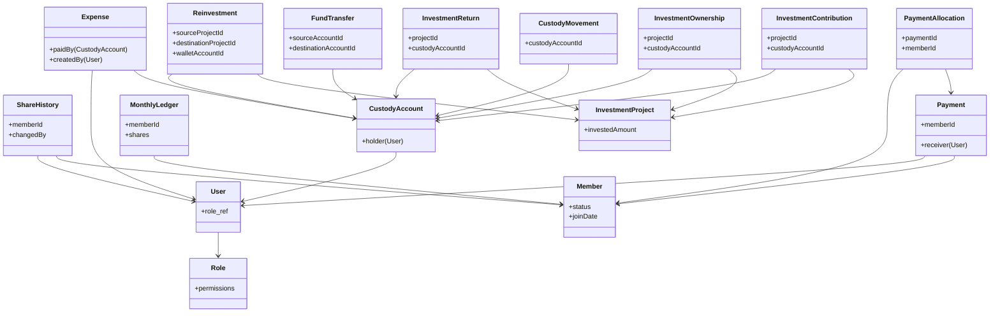

# NS Foundation Web Application — Documentation Analysis & Domain Design

This document provides a comprehensive analysis of the NS Foundation project structure and documentation. It details the database/domain layer entities, dependencies, identified contradictions, risks, and the recommended implementation order.

---

## 1. Project Structure Analysis

The current project structure is clean and represents an uninitialized full-stack template:

- **[`client/`](file:///c:/TechVelly/NSFoundationWebApp/client)**: Empty directory. Set up for the React + TypeScript frontend.
- **[`server/`](file:///c:/TechVelly/NSFoundationWebApp/server)**: Empty directory. Set up for the Node.js + Express + TypeScript + MongoDB (Mongoose) backend.
- **[`docs/`](file:///c:/TechVelly/NSFoundationWebApp/docs)**: Documentation directory containing the following:
  - **[`SRS.md`](file:///c:/TechVelly/NSFoundationWebApp/docs/SRS.md)** (60.3 KB): The authoritative Version 2.0 System Requirements Specification.
  - **[`API-SPECIFICATION.md`](file:///c:/TechVelly/NSFoundationWebApp/docs/API-SPECIFICATION.md)** (0 bytes / Empty placeholder).
  - **[`BUSINESS-RULES.md`](file:///c:/TechVelly/NSFoundationWebApp/docs/BUSINESS-RULES.md)** (0 bytes / Empty placeholder).
  - **[`CHANGELOG.md`](file:///c:/TechVelly/NSFoundationWebApp/docs/CHANGELOG.md)** (0 bytes / Empty placeholder).
  - **[`DATABASE-SCHEMA.md`](file:///c:/TechVelly/NSFoundationWebApp/docs/DATABASE-SCHEMA.md)** (0 bytes / Empty placeholder).
  - **[`DEVELOPMENT-PLAN.md`](file:///c:/TechVelly/NSFoundationWebApp/docs/DEVELOPMENT-PLAN.md)** (0 bytes / Empty placeholder).
  - **[`SYSTEM-DEVELOPMENT-GUIDELINE.md`](file:///c:/TechVelly/NSFoundationWebApp/docs/SYSTEM-DEVELOPMENT-GUIDELINE.md)** (0 bytes / Empty placeholder).
- **[`package.json`](file:///c:/TechVelly/NSFoundationWebApp/package.json)** (0 bytes / Empty placeholder): Root package definition.
- **[`README.md`](file:///c:/TechVelly/NSFoundationWebApp/README.md)** (46 bytes): Standard repository title placeholder.

---

## 2. Documentation Understood

We have analyzed [`docs/SRS.md`](file:///c:/TechVelly/NSFoundationWebApp/docs/SRS.md) in detail. It represents a consolidated baseline specifying functional, non-functional, accounting, and security requirements. 

### Key Principles Verified:
- **Separation of Concepts**: 
  - `OWNERSHIP ≠ CUSTODY` (Custodian of money does not define its original capital ownership).
  - `PRINCIPAL ≠ PENALTY` (Principal collections go to the member's share count; penalties are separate operational income).
  - `PRINCIPAL ≠ PAYMENT CHANNEL CHARGES (CO)` (CO charges paid by members offset gateway fees and are not principal dues).
  - `PAYMENT ≠ PAYMENT ALLOCATION` (One physical cash receipt can be allocated across multiple months of dues/advance).
  - `DUE ≠ CASH RECEIVED` (Unpaid monthly obligations generate dues and potential penalties; payments satisfy those dues).
  - `ADVANCE COVERAGE ≠ NEW CASH TRANSACTION` (Prepayments do not duplicate cash records).
  - `INTERNAL TRANSFER ≠ INCOME/EXPENSE` (Moving cash between custody locations has zero effect on income statement).
  - `INVESTMENT RETURN ≠ AUTOMATIC ACCOUNTANT CASH` (Matured funds remaining in project/external wallets do not increase accountant custody).
  - `REINVESTMENT ≠ NEW ACCOUNTANT DEDUCTION` (Rolled over project funds are not deducted from accountant custody again).
  - `2024 INTERIM SHARE CHANGE ≠ FINAL 2024 SHARE ENTITLEMENT` (2024 changes are historical; December 2024 final count determines reconciliation).

---

## 3. Contradictions Identified & Resolved

As all documentation files in [`docs/`](file:///c:/TechVelly/NSFoundationWebApp/docs) except [`SRS.md`](file:///c:/TechVelly/NSFoundationWebApp/docs/SRS.md) are currently empty placeholders, we analyzed the internal discrepancies documented and resolved by the authoritative Version 2.0 SRS overrides:

| Subject | Legacy Wording / Earlier Assumptions | Authoritative SRS v2.0 Resolution |
| :--- | :--- | :--- |
| **January 2025 Penalty Rate** | Original business requirement: 20 BDT/share through Jan 2025, 40 BDT/share from Feb 2025. Development guidelines: Jan 2025 is 20 BDT/share, Feb 2025 onward is 40 BDT/share. | Jan 2025 = 20 BDT/share; Feb 2025 onward = 40 BDT/share. Historical 2024 rate must be configuration-driven and verified during migration. |
| **Investment Ownership Model** | Earlier drafts required member-to-specific-project investment allocations. | **Common Pooled Investment Model** is used. Individual project ownership is not tracked for members; funds are pooled. |
| **2024 Share Baseline** | Assumed 2024 share changes continuously impact monthly distribution. | 2024 share history is preserved for reference, but the final December 2024 share count determines the baseline for annual reconciliation. |
| **Share Changes Post-2024** | Earlier specs allowed ongoing member share increases/decreases. | **Share Lock from 1 January 2025**: Normal share changes are completely locked. |
| **Investment Returns** | Returned funds assumed to immediately increase primary accountant custody. | Custody remains in the project/wallet until a verified transfer to the accountant occurs. |
| **Reinvestment** | Reinvested funds from matured projects risk double-deduction from accountants. | Only newly supplied funds reduce accountant custody. Existing project/wallet funds are not double-deducted. |

---

## 4. Database/Domain Entities Required

To enforce these rules correctly in MongoDB, we require the following database entities:

### A. RBAC & User Management
1. **`User`**
   - `_id`: Object ID
   - `username`: String (unique)
   - `passwordHash`: String
   - `role`: Reference to `Role`
   - `isActive`: Boolean
2. **`Role`**
   - `_id`: Object ID
   - `name`: String (`Super Admin`, `Accountant`, `Investment Manager`)
   - `permissions`: Array of Strings
3. **`AuditLog`**
   - `_id`: Object ID
   - `timestamp`: Date
   - `userId`: Reference to `User`
   - `action`: String
   - `entityName`: String
   - `entityId`: String
   - `beforeState`: Mixed/JSON (null for creations)
   - `afterState`: Mixed/JSON (null for deletions)
   - `source`: String
   - `reason`: String

### B. Member & Shares Management
4. **`Member`**
   - `memberId`: String (unique, e.g., `MEM-000001`)
   - `name`: String
   - `status`: String (`Active`, `Freeze`, `Left`)
   - `joinDate`: Date
   - `contactInfo`: String
   - `exitDeductionPercent`: Number (default `9.99`)
5. **`ShareHistory`**
   - `shareHistoryId`: String (unique, e.g., `SH-000001`)
   - `memberId`: Reference to `Member`
   - `effectiveFrom`: String (YYYY-MM)
   - `newShares`: Number
   - `prevShares`: Number
   - `changedBy`: Reference to `User`
   - `reason`: String

### C. Collections & Payments Management
6. **`SystemConfig`**
   - `key`: String
   - `value`: Mixed
   - `effectiveFrom`: Date
   - `effectiveTo`: Date
   - `active`: Boolean
   - `reason`: String
7. **`PenaltyRule`**
   - `effectiveFrom`: String (YYYY-MM)
   - `effectiveTo`: String (YYYY-MM)
   - `amountPerShare`: Number
   - `active`: Boolean
   - `reason`: String
8. **`PenaltyWaiver`**
   - `waiverId`: String (unique)
   - `month`: String (YYYY-MM, unique index)
   - `enabled`: Boolean
   - `reason`: String
   - `createdBy`: Reference to `User`
9. **`GatewayRate`**
   - `gateway`: String (unique index, e.g. `Bank`, `bKash`, `Nagad`)
   - `rate`: Number
   - `rateUnit`: String (`FLAT`, `PERCENT`)
   - `effectiveFrom`: Date
   - `effectiveTo`: Date
   - `active`: Boolean
10. **`Payment`**
    - `paymentId`: String (unique, e.g., `PAY-YYYY-000001`)
    - `memberId`: Reference to `Member`
    - `totalCashReceived`: Number
    - `paidAmount`: Number (Principal portion)
    - `paidPenalty`: Number (Penalty portion)
    - `coChargePaid`: Number (Gateway cashout portion)
    - `paymentDate`: Date
    - `gateway`: String (e.g. `bKash`, `Nagad`, `Bank`)
    - `receiver`: Reference to `User` (Moin or Samrat)
    - `sourceReference`: String (For sheets migration correlation)
    - `status`: String (`VERIFIED`, `REVIEW_REQUIRED`, `REVERSED`)
    - `reversedByPaymentId`: Reference to `Payment` (Self-referential link for audit)
11. **`PaymentAllocation`**
    - `_id`: Object ID
    - `paymentId`: Reference to `Payment`
    - `memberId`: Reference to `Member`
    - `contributionMonth`: String (YYYY-MM)
    - `principalAllocated`: Number
    - `penaltyAllocated`: Number
    - `advanceBalance`: Number (Unused principal after allocation)

### D. Ledgers & Cached Snapshots
12. **`MonthlyLedger`** (Aggregated view of member state per month, updated incrementally)
    - `memberId`: Reference to `Member`
    - `month`: String (YYYY-MM)
    - `shares`: Number (derived from `ShareHistory`)
    - `obligationPrincipal`: Number (shares × shareValue)
    - `previousDuePrincipal`: Number
    - `previousDuePenalty`: Number
    - `paidPrincipal`: Number (sum of allocations)
    - `paidPenalty`: Number (sum of allocations)
    - `waivedPenalty`: Number
    - `currentDuePrincipal`: Number
    - `currentDuePenalty`: Number
    - `totalDue`: Number
    - `advanceBalance`: Number
    - `status`: String (`PAID`, `PARTIAL`, `DUE`, `ADVANCE_COVERED`, `WAIVED`, `OVERDUE`)

### E. Custody & Internal Fund Transfers
13. **`CustodyAccount`**
    - `_id`: Object ID
    - `accountName`: String (e.g., `Moin Islami Bank`, `Samrat Nagad`, `GrowUp Wallet`)
    - `holder`: Reference to `User` (or `EXTERNAL_PLATFORM` / `GrowUp`)
    - `type`: String (`Cash`, `Bank`, `bKash`, `Nagad`, `Wallet`)
    - `currentBalance`: Number (cached, derived from movements)
    - `active`: Boolean
14. **`CustodyMovement`**
    - `_id`: Object ID
    - `custodyAccountId`: Reference to `CustodyAccount`
    - `date`: Date
    - `amount`: Number
    - `movementType`: String (`IN`, `OUT`)
    - `sourceType`: String (`PAYMENT`, `EXPENSE`, `INVESTMENT_FUND`, `INVESTMENT_RETURN`, `TRANSFER`)
    - `sourceRefId`: Object ID (references target transaction)
    - `createdBy`: Reference to `User`
15. **`FundTransfer`**
    - `transferId`: String (unique)
    - `sourceAccountId`: Reference to `CustodyAccount`
    - `destinationAccountId`: Reference to `CustodyAccount`
    - `amount`: Number
    - `date`: Date
    - `createdBy`: Reference to `User`
    - `status`: String (`PENDING`, `APPROVED`, `REJECTED`)

### F. Investment Management
16. **`InvestmentProject`**
    - `projectId`: String (unique)
    - `serialNo`: String
    - `invoiceNo`: String
    - `projectName`: String
    - `projectType`: String
    - `borrowerName`: String
    - `borrowerPhone`: String
    - `startDate`: Date
    - `maturityDate`: Date
    - `durationMonths`: Number
    - `investedAmount`: Number
    - `expectedProfitPct`: Number
    - `expectedProfit`: Number
    - `expectedTotalReturn`: Number
    - `actualReturn`: Number
    - `actualProfit`: Number
    - `profitLoss`: Number (positive for profit, negative for loss)
    - `status`: String (`ACTIVE`, `SETTLED`, `LOSS`)
    - `notes`: String
17. **`InvestmentContribution`** (Initial funding supplied)
    - `_id`: Object ID
    - `projectId`: Reference to `InvestmentProject`
    - `custodyAccountId`: Reference to `CustodyAccount`
    - `amount`: Number
    - `date`: Date
18. **`InvestmentOwnership`** (Ownership split logic)
    - `_id`: Object ID
    - `projectId`: Reference to `InvestmentProject`
    - `custodyAccountId`: Reference to `CustodyAccount` (Custodian source)
    - `capitalAmount`: Number
19. **`InvestmentReturn`**
    - `returnId`: String (unique)
    - `projectId`: Reference to `InvestmentProject`
    - `receivedDate`: Date
    - `custodyAccountId`: Reference to `CustodyAccount` (GrowUp Wallet, Moin Bank, etc.)
    - `totalReceived`: Number
    - `principalPortion`: Number
    - `profitPortion`: Number
    - `outstandingPrincipal`: Number
    - `notes`: String
20. **`Reinvestment`**
    - `reinvestmentId`: String (unique)
    - `sourceProjectId`: Reference to `InvestmentProject`
    - `destinationProjectId`: Reference to `InvestmentProject`
    - `walletAccountId`: Reference to `CustodyAccount`
    - `maturedAmountUsed`: Number
    - `accountantNewFundsUsed`: Number
    - `date`: Date

### G. Expense Management
21. **`Expense`**
    - `expenseId`: String (unique)
    - `date`: Date
    - `category`: String
    - `description`: String
    - `amount`: Number
    - `paymentMethod`: String
    - `paidBy`: Reference to `CustodyAccount`
    - `referenceDoc`: String (URL to receipt)
    - `createdBy`: Reference to `User`

### H. Policy Management
22. **`Policy`**
    - `policyId`: String
    - `serialNo`: Number
    - `title`: String
    - `content`: String
23. **`PolicyVersion`**
    - `version`: Number
    - `policyId`: Reference to `Policy`
    - `content`: String
    - `approvedBy`: Reference to `User`
    - `createdAt`: Date

---

## 5. Dependencies Between Entities

The diagram below highlights key relationships between these entities:

---

## 6. Risks & Ambiguities Requiring Human Decision

Before we begin coding, the following ambiguities and risks must be highlighted for decision:

> [!WARNING]
> ### 1. Buyer's Entitlement on Transferred Shares Post-2024
> **Risk:** Under SRS v2.0, released shares can be bought by another member after 31 December 2024, but the buyer's accumulated distribution entitlement is **not finalized**.
> **Action Required:** We must implement the share transfer UI and record-keeping, but the system must block automatic distribution calculations for these specific shares until an organizational rule is finalized.

> [!IMPORTANT]
> ### 2. Historical 2024 Penalty Rates
> **Ambiguity:** Legacy documents disagree on the historical penalty rate during the year 2024.
> **Action Required:** The user must provide the authoritative historical penalty rates (e.g., flat 20 BDT/share or other) applied in the 2024 Excel sheets so we can seed the `PenaltyRule` database configuration accurately prior to running the migration.

> [!NOTE]
> ### 3. Definition of Partial Payment Future Coverage
> **Ambiguity:** If a member pays an amount that is not a multiple of the monthly share obligation (e.g., monthly obligation is 1,000 BDT, but they pay 2,500 BDT), how is the remaining 500 BDT handled?
> **Suggested Strategy:** Fully cover 2 months. Store the remaining 500 BDT in `PaymentAllocation.advanceBalance` to be applied against the next month's principal due. The UI must clearly display this partial credit.

> [!CAUTION]
> ### 4. Multi-Payer Investment Ownership Tracking
> **Risk:** Since multiple accountants can fund one project (e.g., Moin 25,000 + Samrat 25,000 = 50,000), return settlements must handle principal and profit portions accurately. If a return is only partially received or returned to a single accountant, the original ownership percentages must not be lost.
> **Suggested Strategy:** Store direct `InvestmentOwnership` splits mapping back to the contributing accountant's custody account when funding occurs. This ensures returns can be audited against original capital contributions.

---

## 7. Recommended Implementation Order

To ensure correctness and auditability, we propose implementing the database and domain logic in the following phase order:

1. **Phase 1: Project Initialization & Schema Seeding**
   - Initialize package dependencies, TypeScript config, and Mongoose connection.
   - Seed initial Roles, Permissions, and Admin accounts.
2. **Phase 2: Member & Share History Module**
   - Implement `Member` and `ShareHistory` models.
   - Implement share-lock validations (blocking normal post-2024 updates).
3. **Phase 3: Config, Waivers & Rates Settings**
   - Seed gateway rates, penalty rules, and monthly deadlines.
   - Implement waiver configurations.
4. **Phase 4: Payments & Allocations (The Core Transaction Engine)**
   - Implement the atomic payment transaction service:
     `Create Payment` ➔ `Allocate oldest dues first` ➔ `Calculate advance balances` ➔ `Create Custody Movement`.
   - Implement transaction reversal logic (creating compensating reversals instead of physical deletions).
5. **Phase 5: Incremental Ledger Engine**
   - Implement the `MonthlyLedger` recalculation service triggered by payment mutations.
6. **Phase 6: Custody, Transfers, and Expenses**
   - Implement custody accounts, custody movements, internal transfers, and expenses.
7. **Phase 7: Investments & Reinvestments**
   - Implement projects, contributions, ownership splits, returns, and reinvestment chains.
8. **Phase 8: Audit Logging & Database Indexing**
   - Hook up audit log hooks (Mongoose post-save/update middleware).
   - Verify index optimization for performance.
9. **Phase 9: Data Migration & 2024 Reconciliation**
   - Build migration pipelines.
   - Reconcile MongoDB ledger outcomes against 2024 published sheets.
