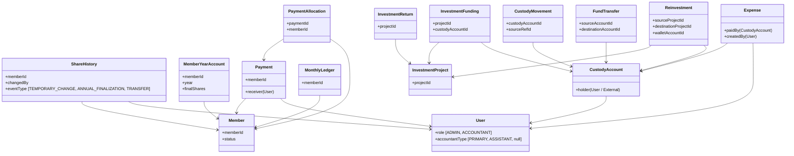

# NS Foundation Web Application — Final Approved Domain Architecture

This document defines the final, approved domain-model design, database entities, classifications, and implementation order for the NS Foundation Web Application.

---

## 1. Final Entity List & Core Purpose

For every entity, we define its purpose and explicitly classify it under the following domain categories:
* **Membership / Distribution Entitlement**
* **Source of truth**
* **Derived/cached**
* **Operational funding**
* **Custody/location**
* **Accounting transaction**
* **Audit/history**
* **Configuration**

### A. Core Membership & Shares
1. **`Member`**
   - **Category**: `Membership / Distribution Entitlement`
   - **Purpose**: Represents the active individuals who hold cooperative membership and are entitled to final distributions based on approved rules.
2. **`ShareHistory`**
   - **Category**: `Source of truth` / `Audit/history`
   - **Purpose**: Immutably records member share changes with an effective month (YYYY-MM). Supports explicit event types: `TEMPORARY_CHANGE`, `ANNUAL_FINALIZATION`, and `TRANSFER`. Normal changes are locked from January 1, 2025.
3. **`MemberYearAccount`**
   - **Category**: `Source of truth`
   - **Purpose**: Stores the authoritative annual reconciliation state for each member and year.

### B. Security, Users & RBAC
4. **`User`**
   - **Category**: `Audit/history`
   - **Purpose**: Stores credentials and manages administrative access (`role`, `accountantType`). Standard roles are `ADMIN` and `ACCOUNTANT`. Accountant types are `PRIMARY` (Moin) and `ASSISTANT` (Samrat).
5. **`AuditLog`**
   - **Category**: `Audit/history`
   - **Purpose**: Immutably records sensitive write/update/delete database operations, storing before and after states, the performing user, and reasons.

### C. Rule & Config Parameters
6. **`SystemConfig`**
   - **Category**: `Configuration`
   - **Purpose**: Stores effective-dated parameters governing calculations (e.g. monthly share value).
7. **`PenaltyRule`**
   - **Category**: `Configuration` / `Policy Parameter`
   - **Purpose**: Stores effective-dated penalty rates per share (e.g. 20 BDT/share for January 2025; 40 BDT/share for February 2025 onward).
8. **`PenaltyWaiver`**
   - **Category**: `Configuration` / `Policy Exception`
   - **Purpose**: Logs specific months where the standard late payment penalty is globally waived.
9. **`GatewayRate`**
   - **Category**: `Configuration` / `Fee Rule`
   - **Purpose**: Stores cashout rates and fees for different payment channels (e.g., Bank, bKash, Nagad).

### D. Financial Transactions & Ledger Projections
10. **`Payment`**
    - **Category**: `Source of truth` / `Accounting transaction`
    - **Purpose**: Records physical cash receipts collected by the Primary or Assistant Accountant.
11. **`PaymentAllocation`**
    - **Category**: `Source of truth` / `Accounting transaction`
    - **Purpose**: Allocates a payment's principal across previous due, principal, penalty, current obligation, and advance. The allocation algorithm is resolved in the business service layer.
12. **`MonthlyLedger`**
    - **Category**: `Derived/cached`
    - **Purpose**: A cached projection of member obligations, payments, waivers, dues, and payment status for performance. Fully rebuildable from source transactions.

### E. Cash Custody & Internal Movements
13. **`CustodyAccount`**
    - **Category**: `Custody/location` / `Derived/cached` (balance)
    - **Purpose**: Identifies a distinct repository of Foundation money (e.g. Moin Islami Bank, Samrat Nagad, GrowUp Wallet, Project Wallet). Holds a cached balance derived from movements.
14. **`CustodyMovement`**
    - **Category**: `Source of truth` / `Accounting transaction`
    - **Purpose**: The authoritative financial movement ledger tracking all cash inflows (`IN`) and outflows (`OUT`) for custody accounts.
15. **`FundTransfer`**
    - **Category**: `Source of truth` / `Accounting transaction`
    - **Purpose**: Records business-level internal custody-to-custody transfer events (e.g., Samrat consolidation transfer to Moin custody) which generate linked `OUT` and `IN` movement records, yielding zero net effect on income/expense.

### F. Investment Projects & Operational Funding
16. **`InvestmentProject`**
    - **Category**: `Custody/location` / `Source of truth`
    - **Purpose**: Represents an active external investment project where pooled assets reside.
17. **`InvestmentFunding`**
    - **Category**: `Operational funding` / `Source of truth`
    - **Purpose**: Immutably records which specific `CustodyAccount` (Moin/Samrat) operationally supplied cash to an `InvestmentProject`. Does not represent economic ownership.
18. **`InvestmentReturn`**
    - **Category**: `Source of truth` / `Accounting transaction`
    - **Purpose**: Records project maturity return events, splitting returns into principal, actual profit, actual loss, total return, maturity date, and notes. Cash custody movement is represented separately.
19. **`Reinvestment`**
    - **Category**: `Source of truth` / `Accounting transaction`
    - **Purpose**: Links wallet proceeds from matured investments to new investments, ensuring only newly added custody funds are deducted from accountants.

### G. Operational Expenses
20. **`Expense`**
    - **Category**: `Source of truth` / `Accounting transaction`
    - **Purpose**: Records general operational expenditures paid out of a `CustodyAccount` which reduce Net Foundation assets.

### H. Guidelines (Future Module)
21. **`Policy`**
    - **Category**: `Audit/history` (Planned/Future)
    - **Purpose**: Stores official serial-ordered organizational rules.
22. **`PolicyVersion`**
    - **Category**: `Audit/history` (Planned/Future)
    - **Purpose**: Tracks version history and Super Admin edits to policy records.

---

## 2. Entity Relationships

---

## 3. Core Models & Architectural Explanations

### A. Investment Model (Common Pooled Fund)
* **Pooled Asset ownership**: Member contributions form a single pooled investment fund. No project-level investment ownership is allocated to members. 
* **Operational funding**: Traced strictly through `InvestmentFunding` and `InvestmentReturn`. `InvestmentFunding` logs the accountant's `CustodyAccount` that supplied cash, the date, reference, and amount. This is purely operational and does **not** represent economic ownership.
* **Separation of maturity vs cash receipt**: Matured project funds staying in an external project/wallet are recorded in `InvestmentReturn` but do **not** increase accountant custody balances. Accountant balances increase only after a verified `CustodyMovement` (Wallet $\rightarrow$ Accountant) is posted.

### B. Custody Model
* **Locations**: Money resides in `CustodyAccount` locations classified as `ACCOUNTANT CUSTODY` (Moin Cash/Bank, Samrat Nagad/bKash), `EXTERNAL WALLET` (GrowUp, Zayan), `EXTERNAL INVESTMENT` (the active project), or `EXTERNAL PERSON` (direct personal relationships).
* **Movement Source of Truth**: All balances are derived. Direct modifications to account balances are blocked. Every entry is computed dynamically or cached from the `CustodyMovement` transaction ledger.
* **Consolidation**: Transfers (e.g., Samrat consolidation transfer to Moin custody) represent `FundTransfer` events and trigger corresponding `CustodyMovement` entries (OUT from Samrat, IN to Moin) with zero effect on profit or expenses.

### C. Role Model
* **Roles**: Standard roles are `ADMIN` (configuration, auditing, adjustments) and `ACCOUNTANT` (contributions, expenses, returns).
* **Custody Categories**: Handled by the `User.accountantType` property:
  - `PRIMARY`: Moin (assigned `role: ADMIN, accountantType: PRIMARY`). Has primary authority.
  - `ASSISTANT`: Samrat (assigned `role: ACCOUNTANT, accountantType: ASSISTANT`).
* Hardcoded names are prohibited. Permissions are checked purely via role/type properties.

### D. Share/Annual Account Model
* **2024 Share Changes**: Interim share counts are preserved historically in `ShareHistory` using the `TEMPORARY_CHANGE` event type. Reconciliations evaluate payments against the closing December 2024 share count baseline (marked as `ANNUAL_FINALIZATION`).
* **2025 Share Lock**: Normal share changes are fully locked from 1 January 2025. 
* **Post-2024 Share Transfers**: Supported via `TRANSFER` event type, but distribution entitlement logic for the buyer remains **undecided**. No automatic distribution logic should be coded for these shares.
* **Reconciliation Source of Truth**: `MemberYearAccount` stores the authoritative annual reconciliation state.

---

## 4. Risks & Unresolved Decisions

1. **Buyer entitlement for post-2024 share transfers**: The database records transfers, but distribution entitlement calculations for the buyer are pending decision and will not be automated.
2. **Historical 2024 Penalty Rates**: Exact penalty rate definitions for the 2024 historical period must be verified before seeding the configurations and executing legacy Sheets migration.

---

## 5. Recommended Database Implementation Order

1. **Phase 1: Security & Users**: Define schemas for `User` and `AuditLog`. Seed initial Admin/Accountant profiles.
2. **Phase 2: Member & Share History**: Setup `Member` and `ShareHistory` collections, implementing validation hooks enforcing the post-2024 normal share lock.
3. **Phase 3: Configurations**: Implement `SystemConfig`, `PenaltyRule`, `PenaltyWaiver`, and `GatewayRate`.
4. **Phase 4: Transactions**: Build the core posting engine schemas (`Payment` and `PaymentAllocation`).
5. **Phase 5: Custody & Movements**: Implement `CustodyAccount` and `CustodyMovement`, ensuring balance calculations are derived strictly from movements. Define `FundTransfer` and `Expense` schemas.
6. **Phase 6: Investments**: Define `InvestmentProject`, `InvestmentFunding`, `InvestmentReturn`, and `Reinvestment`.
7. **Phase 7: Annual & Derived Ledgers**: Implement the `MemberYearAccount` and the rebuildable `MonthlyLedger` caching projection schema.
8. **Phase 8: Audit Hooks**: Setup write hooks mapping database mutations to the `AuditLog` collection.
